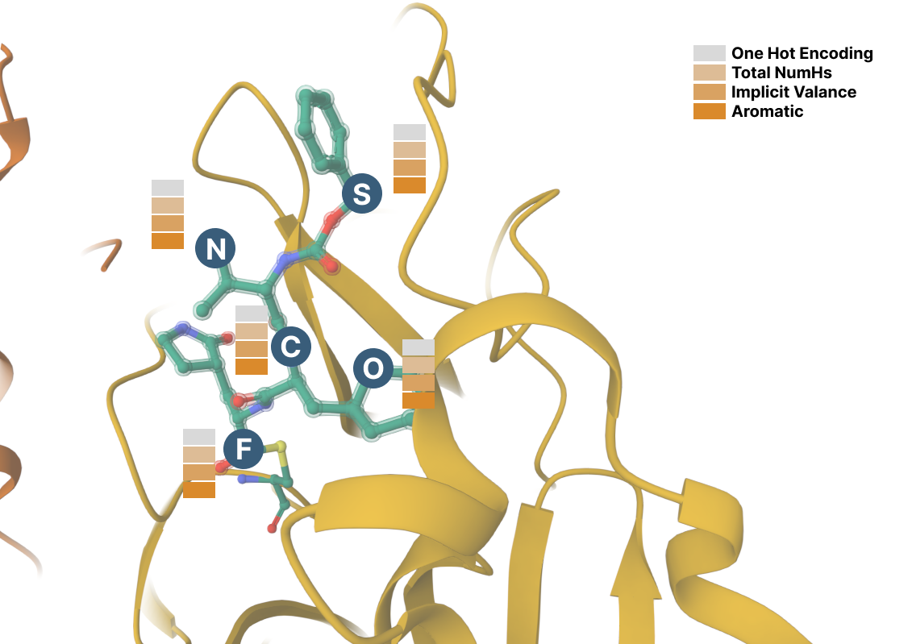

# GraphAMP: Antimicrobial peptide prediction using combination of structural and molecular properties
## Graph Construction


## Node Features


## Graph Convolution


# Architecture


###  source codes:
+ preprocess.py: create data in pytorch format
+ utils.py: include TestbedDataset used by create_data.py to create data, performance measures and functions to draw loss, pearson by epoch.
+ models/ginconv.py, gat.py, gat_gcn.py, and gcn.py: proposed models GINConvNet, GATNet, GAT_GCN, and GCNNet receiving graphs as input for drugs.
+ training.py: train a GraphDRP model.
+ saliancy_map.py: run this to get saliency value.


## Dependencies
+ [Torch](https://pytorch.org/)
+ [Pytorch_geometric](https://github.com/rusty1s/pytorch_geometric)
+ [Rdkit](https://www.rdkit.org/)
+ [Matplotlib](https://matplotlib.org/)
+ [Pandas](https://pandas.pydata.org/)
+ [Numpy](https://numpy.org/)
+ [Scipy](https://docs.scipy.org/doc/)

# Step-by-step running:

## 1. Create data in pytorch format
```sh
python preprocess.py --choice 0
```

This returns file pytorch format (.pt) stored at data/processed including training, validation, test set.

## 2. Train a GraphDRP model
```sh
python training.py --model 0 --train_batch 1024 --val_batch 1024 --test_batch 1024 --lr 0.0001 --num_epoch 300 --log_interval 20 --cuda_name "cuda:0"
```
model:
&nbsp;&nbsp;&nbsp;&nbsp;&nbsp;&nbsp;1: GINConvNet
&nbsp;&nbsp;&nbsp;&nbsp;&nbsp;&nbsp;2: GATNet
&nbsp;&nbsp;&nbsp;&nbsp;&nbsp;&nbsp;3: GAT_GCN
&nbsp;&nbsp;&nbsp;&nbsp;&nbsp;&nbsp;4: GCNNet

To train a model using training data. The model is chosen if it gains the best MSE for testing data. 

This returns the model and result files for the modelling achieving the best MSE for testing data throughout the training.

# Credits
